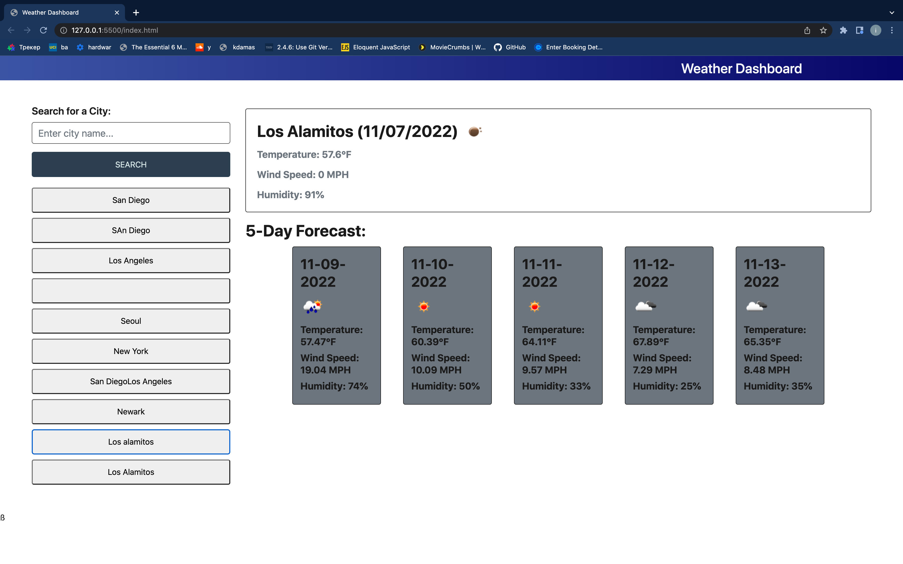

# Weather-Dashboard
Module 6 Challenge

## Description
I was assigned a project in which I had to create a Weather Dashboard using third party APIs. The weather dashboard allows users to search for any city in the world. The application then displays the weather forecast for the current day and the next five days. The forecast contains the temperature in farenheit, the wind speed and the humidity along with an icon representative of the weather condition.

## Table of Contents
<nav>
    <ol>
        <li><a href="#How to Use this Project">How to Use this Project</a></li>
        <li><a href="#Contributors">Contributors</a></li>
    </ol>
</nav>

## How to Use this Project
<a href="https://ivsir.github.io/Weather-Dashboard/">This is the link to my WebPage</a>

## Contributors
Risvi Tareq